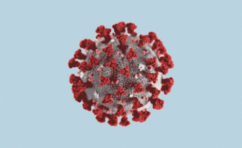

# COVID-19 Global Analysis

End-to-end exploratory data analysis (EDA) and feature engineering project on the **Our World in Data (OWID) COVID-19** dataset, with a focus on:

- Global patterns in cases, deaths and fatality ratios  
- The relationship between vaccination coverage and case fatality ratio (CFR)  
- A compact comparison of seven countries that are central to my network:  
  **Italy, Turkey, Germany, Switzerland, Spain, France and the United Kingdom**

The repository is structured to be easy to review by hiring managers and technical teams: clear folders, reusable modules under `src/`, and analysis notebooks under `notebooks/`.

---

## 1. Dataset

- **Source:** Our World in Data – COVID-19 dataset (https://ourworldindata.org/coronavirus)  
- **Granularity:** One row per country (or region) per date  
- **Content examples:**
  - Epidemiological: total/new cases, total/new deaths, ICU and hospital patients  
  - Testing: total tests, new tests, positive rate, tests per case  
  - Vaccination: total vaccinations, people vaccinated, fully vaccinated, boosters  
  - Demographics & health system: population, median age, hospital beds per thousand, life expectancy  
  - Policy & impact: stringency index, excess mortality metrics and more

Due to GitHub file size limits, **raw and processed CSV files are not tracked in this repository**.

To reproduce the analysis locally:

1. Download the latest OWID COVID-19 CSV from the official website.  
2. Save it as:

    - `data/raw/owid-covid-data.csv`

The cleaning and feature engineering notebooks will then read from this path.

---

## 2. Project structure

Repository layout:

    covid19-global-analysis/
    ├─ assets/
    │  └─ covid19.gif                     # header GIF used in README
    ├─ data/
    │  ├─ raw/
    │  │  └─ owid-covid-data.csv         # (ignored by git, required locally)
    │  ├─ processed/
    │  │  └─ covid19_clean_features.csv  # (ignored by git, created by notebook)
    ├─ notebooks/
    │  ├─ 01_eda_covid19.ipynb           # initial EDA and global overview
    │  ├─ 02_feature_engineering.ipynb   # cleaning + feature engineering pipeline
    │  └─ 03_insights_and_modeling.ipynb # insights + country-level case studies
    ├─ reports/
    │  └─ figures/                       # exported figures
    ├─ src/
    │  ├─ __init__.py                    # makes src a Python package
    │  ├─ config.py                      # paths and shared configuration
    │  ├─ data_loading.py                # reusable data loading functions
    │  ├─ preprocessing.py               # cleaning + feature engineering pipeline
    │  ├─ eda.py                         # EDA helper utilities
    │  ├─ features.py                    # generic feature engineering helpers
    │  └─ visualization.py               # plotting helpers (bar charts, scatter, bars)
    ├─ .gitignore
    ├─ requirements.txt
    └─ README.md

Key design choices:

- **Separation of concerns**
  - Raw vs processed data
  - Reusable Python modules vs exploratory notebooks
- **Reusability**
  - `src/` modules can be imported both in notebooks and in future scripts
- **Scalability**
  - New analyses can be added as additional notebooks or scripts without changing the core structure

---

## 3. Environment & installation

Minimal dependencies (see `requirements.txt`):

- `pandas`  
- `numpy`  
- `matplotlib`  
- `seaborn`  
- `jupyter`

Suggested setup using a virtual environment:

    # Create and activate a virtual environment
    python -m venv .venv
    .venv\Scripts\activate        # on Windows
    # source .venv/bin/activate   # on macOS / Linux

    # Install dependencies
    pip install -r requirements.txt

    # Launch Jupyter
    jupyter notebook

Then open the notebooks in the `notebooks/` directory.

---

## 4. Code modules (`src/`)

### 4.1. `src/config.py`

Centralised configuration (paths, constants):

- `BASE_DIR`, `DATA_DIR`, `RAW_DATA_DIR`, `PROCESSED_DATA_DIR`  
- `COVID_RAW_PATH` – path to `data/raw/owid-covid-data.csv`  
- `COVID_CLEAN_FEATURES_PATH` – path to `data/processed/covid19_clean_features.csv`

This keeps path logic out of the notebooks and functions.

---

### 4.2. `src/data_loading.py`

Reusable loading functions, for example:

- `load_covid_data()` – loads the OWID CSV from `COVID_RAW_PATH` and returns a `pandas.DataFrame`.

This allows notebooks to focus on analysis rather than file-handling boilerplate.

---

### 4.3. `src/preprocessing.py`

Implements the main cleaning and feature engineering pipeline:

- `filter_country_level_rows(df)`  
  - Filters out aggregate OWID entries (e.g. `OWID_WRL`, `OWID_EUR`)  
  - Removes rows with missing `iso_code`  
  - Keeps only country-level observations

- `clean_covid_data(df)`  
  - Safely converts `date` to datetime  
  - Sorts by `location` and `date`  
  - Replaces obviously invalid negative values in selected columns (e.g. `new_cases`, `new_deaths`) with `NaN`  
  - Optionally drops rows with missing `population`

- `add_features(df)`  
  - Adds 7-day rolling averages:
    - `new_cases_pm_7d_avg`  
    - `new_deaths_pm_7d_avg`  
    - `stringency_index_7d_avg` (if available)  
  - Computes `case_fatality_ratio = total_deaths / total_cases` (for rows with `total_cases > 100`)  
  - Creates `vaccination_coverage` based on available vaccination columns

- `build_clean_feature_dataset(df_raw)`  
  - Runs the full pipeline:
    1. Filter to country-level rows  
    2. Clean the dataset  
    3. Add engineered features  
  - Returns a cleaned, feature-enriched DataFrame

---

### 4.4. `src.eda`, `src.features`, `src.visualization`

Helper modules used to keep notebooks clean and modular:

- `src.eda`  
  - `print_basic_info(df)` – prints shape, columns, and dtypes  
  - `compute_missing_ratios(df)` – returns a Series with missing value ratios per column  
  - `get_latest_per_country(df, country_col="location", date_col="date")` – latest row per country

- `src.features`  
  - Generic, reusable feature engineering helpers (e.g. group-based rolling means)

- `src.visualization`  
  - `plot_missing_ratios_bar(missing_ratio, top_n=20, ...)` – horizontal bar chart of missing ratios  
  - `plot_metric_bar(df, metric_col, title, xlabel)` – clean bar charts for per-country metrics  
  - `plot_vaccination_vs_cfr(df, ...)` – scatter plot comparing vaccination coverage and CFR

Notebooks call into these helpers instead of re-defining plotting logic repeatedly.

---

## 5. Notebooks

### 5.1. `01_eda_covid19.ipynb` – Initial EDA

Main steps:

- Load the raw OWID dataset using `load_covid_data()`  
- Use `print_basic_info(df)` and `compute_missing_ratios(df)` to understand:
  - Shape, columns, data types  
  - Columns with high missingness
- Visualise:
  - Top columns by missing value ratio (horizontal bar chart)  
  - Date coverage and basic global trends using `location == "World"`

The goal is to get a high-level understanding of the dataset quality and scope.

---

### 5.2. `02_feature_engineering.ipynb` – Cleaning & feature engineering

Main steps:

- Load the raw dataset  
- Apply the full preprocessing pipeline via `build_clean_feature_dataset(df_raw)`  
- Inspect the resulting `df_clean`:
  - Confirm negative anomalies are removed or set to `NaN`  
  - Check that new feature columns (rolling averages, CFR, vaccination coverage) exist
- Save the cleaned dataset to:

    - `data/processed/covid19_clean_features.csv`

This notebook transforms the raw OWID data into a consistent, analysis-ready dataset.

---

### 5.3. `03_insights_and_modeling.ipynb` – Insights & country case studies

This notebook focuses on **descriptive analytics** and avoids complex machine learning, which would be hard to justify with small effective sample sizes.

Key analyses:

1. **Global patterns**
   - Top 10 countries by:
     - `total_cases_per_million`
     - `total_deaths_per_million`
   - Distribution of `case_fatality_ratio` at country level:
     - 204 countries with non-null CFR  
     - Mean CFR ≈ 1.53%  
     - Median CFR ≈ 1.14%  
     - Right-skewed distribution with a few high-CFR outliers
   - Global relationship between `vaccination_coverage` and `case_fatality_ratio`:
     - 36 countries with both metrics available  
     - Pearson correlation ≈ −0.499 → moderate negative association  
       (higher vaccination coverage tends to be associated with lower CFR)

2. **Country case studies** – Italy, Turkey, Germany, Switzerland, Spain, France, United Kingdom
   - Using the latest available date per country, build a compact summary table with:
     - `total_cases_per_million`  
     - `total_deaths_per_million`  
     - `case_fatality_ratio` (in %)  
     - `vaccination_coverage` (in %)
   - Visualise with four clean horizontal bar charts:
     - Total cases per million  
     - Total deaths per million  
     - Case fatality ratio (%)  
     - Vaccination coverage (%)

   These bar charts provide an interpretable, LinkedIn-friendly comparison across the seven selected countries.

Optional pairwise time series (e.g. Italy vs Turkey) can be used to illustrate:

- Different timing and magnitude of waves  
- The partial decoupling between cases and deaths in the vaccination era (large case waves with relatively lower death waves compared to early 2020)

---

## 6. Key findings (high-level)

- **Per-capita impact matters**: per-million metrics highlight that some small or highly tested countries appear at the top of global rankings for cases per million.  
- **Fatality ratios cluster**: most countries have CFR in the 1–2% range, with a limited number of high-CFR outliers.  
- **Vaccination and CFR are moderately associated**: in the subset of countries with reliable vaccination data, higher vaccination coverage is moderately associated with lower CFR (correlation ≈ −0.5), though many confounding factors remain.  
- **Selected European countries and Turkey**:
  - All show high cumulative case and death burdens, but differ in deaths per million and CFR.  
  - Vaccination coverage is generally high but not identical, and does not fully explain CFR differences.  
  - Structural factors such as demographics, healthcare capacity, testing strategies and reporting practices also play a major role.

---

## 7. Limitations

- Correlation does not imply causation: this project does not attempt a full causal inference analysis.  
- CFR depends heavily on testing intensity; countries with fewer detected cases may show artificially high CFR.  
- Data quality and reporting standards vary between countries; some differences may be due to measurement noise.  
- The analysis uses simple ratios and descriptive statistics, by design, to remain interpretable.

---

## 8. How to reuse / extend this project

Possible extensions:

- Add more country groups (e.g. by income level, region, or demographic profile).  
- Explore time windows (e.g. first wave vs vaccination era) separately.  
- Integrate additional OWID indicators (hospital capacity, excess mortality) into new features.  
- Replace or complement notebook analysis with scripts under a `scripts/` folder for automated runs.

The current structure (modules under `src/` + notebooks under `notebooks/`) is meant to be a clean starting point for further COVID-19 or time-series analytics work.
